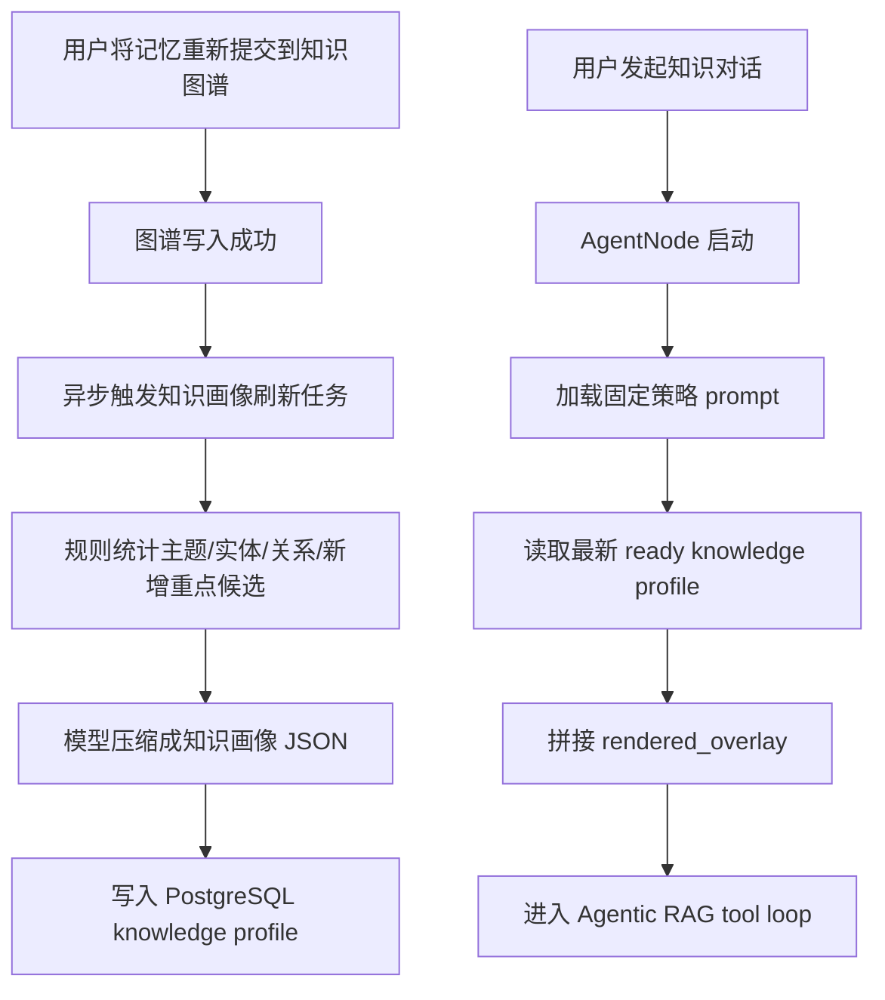

# Agent Knowledge Profile Overlay Design

## 背景

当前项目的 Agentic RAG 入口使用固定的系统提示词来描述知识库范围，例如“计算机相关知识”和“垃圾分类相关知识”。这在知识量较少时可以工作，但随着用户持续把更多记忆写入知识图谱，静态提示词会逐渐失真，导致 Agent 在起手判断阶段缺少对当前知识库范围的真实认知。

这会影响以下行为：

- 是否优先调用 `graph_retrieval_tool`
- 检索 query 的提炼方向是否贴合当前知识图谱
- 多跳检索是否能优先围绕图谱里的真实高频主题和实体展开
- 面对新近写入的知识时，Agent 是否知道“这些内容现在就在我的知识库里”

因此需要引入一层可自动更新的“知识画像”，并在 Agent 启动时把它作为动态 prompt overlay 注入，而不是继续只依赖固定知识域描述。

## 目标

在不破坏现有 Agentic RAG tool loop 结构的前提下，新增一套随知识图谱变化自动更新的知识画像机制，使 Agent 在每次开始对话时都能读取最新的图谱知识范围摘要。

第一版目标：

- 在知识图谱写入成功后，异步刷新一份全局知识画像
- 将知识画像保存到当前项目的 PostgreSQL
- `AgentNode` 在运行时自动读取最新的知识画像 overlay
- 将 overlay 与固定策略 prompt 组合后注入 Agent
- 刷新失败时不影响聊天主流程

## 非目标

第一版不做以下内容：

- 不为不同用户、不同 group、不同知识库分别生成多份画像
- 不在前端提供知识画像管理页
- 不支持手动编辑知识画像
- 不直接重写整段固定系统 prompt
- 不让 Agent 每次对话额外调用“获取知识画像”的工具

## 方案对比

### 方案 1：每次写图谱后重写整段 Agent prompt

在知识图谱写入成功后，直接让模型重新生成一整段新的 Agent system prompt，并覆盖当前固定提示词。

优点：

- 直观
- 看起来一步到位

缺点：

- 行为规则和知识描述混在一起，维护成本高
- prompt 漂移风险大
- 难以区分错误是策略问题还是知识描述问题

### 方案 2：固定策略 prompt + 动态知识画像 overlay（推荐）

保留当前固定的 Agent 行为规则 prompt，只把“当前知识图谱里主要有什么”做成动态 overlay。知识图谱更新后异步刷新这份 overlay，并在 `AgentNode` 运行时拼接到固定 prompt 后面。

优点：

- 固定策略和动态知识范围分离，结构最稳定
- 运行时开销低
- 易于调试和后续扩展

缺点：

- 需要新增一套异步刷新和持久化机制

### 方案 3：新增“知识画像工具”

Agent 每次开始前先调用一个工具获取当前知识画像，再决定是否检索。

优点：

- 结构清晰

缺点：

- 每次对话都会多一个步骤
- 对当前项目来说实现和运行成本偏高
- 起手判断不如运行时 overlay 直接

推荐方案：方案 2。

## 总体架构



## 知识画像内容

第一版只生成 4 类内容：

- `major_topics`
- `high_frequency_entities`
- `high_frequency_relations`
- `recent_focuses`

示例：

```json
{
  "major_topics": ["前端开发", "后端架构", "知识图谱", "垃圾分类"],
  "high_frequency_entities": ["UI", "UX", "API", "Playwright", "塑料包装与容器"],
  "high_frequency_relations": ["属于", "实现方式", "调用关系", "收集时间"],
  "recent_focuses": ["冒烟测试", "全链路测试", "Agentic RAG", "前后端交互"]
}
```

运行时再渲染为 overlay 文本，例如：

```text
当前知识图谱知识画像（自动生成）：
- 主要主题：前端开发、后端架构、知识图谱、垃圾分类
- 高频实体：UI、UX、API、Playwright、塑料包装与容器
- 高频关系：属于、实现方式、调用关系、收集时间
- 最近新增知识重点：冒烟测试、全链路测试、Agentic RAG、前后端交互
当用户问题与这些内容相关时，优先考虑调用 graph_retrieval_tool。
```

## 数据库存储设计

第一版只维护一份全局知识画像，保存到 PostgreSQL。

建议表：`agent_knowledge_profiles`

建议字段：

- `id`
- `profile_type`
  - 第一版固定为 `global_agent_overlay`
- `major_topics` `jsonb`
- `high_frequency_entities` `jsonb`
- `high_frequency_relations` `jsonb`
- `recent_focuses` `jsonb`
- `rendered_overlay` `text`
- `status`
  - `building`
  - `ready`
  - `failed`
- `error_message`
- `updated_at`

设计原则：

- 结构化字段用于调试、可视化和后续扩展
- `rendered_overlay` 用于运行时直接注入 Agent prompt
- `AgentNode` 只读取最新 `ready` 的记录

## 刷新触发与去抖

刷新触发点必须挂在“成功写入知识图谱”之后，而不是普通记忆保存之后。只有真正进入图谱的内容，才应该影响 Agent 的知识画像。

为了避免用户连续提交多条知识时频繁触发模型总结，第一版引入简单去抖/合并：

- 图谱写入成功后标记“需要刷新画像”
- 10 秒内多次写图谱，只最终执行一次刷新

这条规则的目标是减少模型调用，避免知识画像刷新任务压住图谱写入交互。

## 候选抽取策略

第一版采用“规则统计 + 模型压缩”的双阶段方案。

### 第 1 阶段：规则统计候选

从知识图谱中抽取以下候选：

- 高频实体候选
- 高频关系候选
- 最近新增实体/关系候选
- 最近写入内容的标题或主题候选

`recent_focuses` 的时间窗口第一版采用：

- 最近 50 条成功写入知识图谱的内容

选择条数窗口而不是自然时间的原因：

- 对个人本地知识库更稳定
- 更能反映“最近真正关注了什么”

### 第 2 阶段：模型压缩

把规则阶段的候选摘要交给模型，要求模型输出结构化 JSON：

- `major_topics`
- `high_frequency_entities`
- `high_frequency_relations`
- `recent_focuses`

这样可以兼顾：

- 规则统计的稳定性
- 模型总结的可读性

## Agent 运行时注入方式

`AgentNode` 不负责生成知识画像，只负责读取和使用。

运行时步骤：

1. 加载固定策略 prompt
2. 查询数据库中最新一条 `status=ready` 的全局知识画像
3. 如果存在，则把 `rendered_overlay` 拼接到固定策略 prompt 后面
4. 如果不存在，则只使用固定策略 prompt
5. 进入现有 Agentic RAG tool loop

这样可以保证：

- 聊天主链不依赖刷新任务是否成功
- 知识画像只是增强项，不会成为硬阻塞

## 错误处理与兜底

### 刷新失败

如果知识画像刷新失败：

- 保留上一版 `ready` 画像继续使用
- 新一轮聊天不受影响

### 从未生成成功

如果系统里还没有任何一版成功的知识画像：

- 直接回退到固定基础 prompt

### 异步任务异常

异步任务失败时应：

- 标记最新记录为 `failed`
- 保存错误信息
- 不回滚历史 `ready` 数据

## 模块边界

建议新增和改动的模块边界如下：

- 新增知识画像仓储/服务
  - 负责读取、写入、选择最新 ready profile
- 新增知识画像刷新任务
  - 负责去抖、候选抽取、模型压缩、持久化
- 图谱写入流程
  - 负责在成功写入后触发刷新任务
- `AgentNode`
  - 只负责读取 overlay 并注入 prompt

这可以保持职责清晰：

- 图谱写入管“触发”
- 刷新任务管“生成”
- PostgreSQL 管“持久化”
- AgentNode 管“使用”

## P0 / P1 优先级

### P0

- 建立 `agent_knowledge_profiles` 表
- 新增知识画像仓储与读取逻辑
- 在图谱写入成功后异步触发刷新
- 实现候选统计
- 实现模型压缩输出 4 类画像
- 持久化 `rendered_overlay`
- `AgentNode` 运行时注入 overlay
- 失败时回退到上一版 ready 或固定 prompt

### P1

- 前端管理页查看当前知识画像
- 手动触发重新生成
- 展示刷新状态、失败状态和最近更新时间
- 优化主题抽取和 recent focus 的聚类质量
- 如果后续出现多知识空间需求，再考虑多 profile 扩展

## 验收标准

- 向知识图谱成功写入新知识后，不阻塞用户操作
- 10 秒内多次写图谱只触发一次刷新
- PostgreSQL 中能看到最新 `ready` 的知识画像记录
- `AgentNode` 在新对话中能读取到最新 overlay
- 当最近新增知识明显变化时，Agent 起手判断与检索重点能体现这些变化
- 刷新失败时，聊天功能仍然正常

## 风险与注意事项

### 风险 1：模型生成画像不稳定

缓解方式：

- 先做规则候选约束
- 模型只负责压缩，不直接读全图谱

### 风险 2：刷新过于频繁

缓解方式：

- 10 秒去抖/合并
- 第一版采用全局唯一 profile

### 风险 3：overlay 过长

缓解方式：

- 限制每类最多输出固定数量项
- `rendered_overlay` 保持紧凑

## 结论

推荐方案是：

- 保留固定策略 prompt
- 引入 PostgreSQL 持久化的全局知识画像
- 在知识图谱写入成功后异步刷新
- 使用“规则统计 + 模型压缩”生成 4 类知识画像
- 由 `AgentNode` 在运行时自动注入 `rendered_overlay`

这是当前项目里最稳、最易维护、也最贴近你需求的方案。
