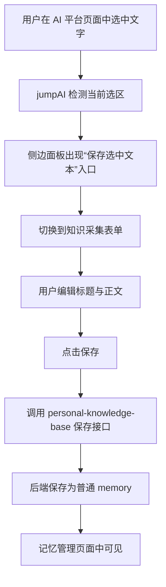

# Browser Extension Knowledge Capture Design

## 背景

当前项目的个人知识库已经具备以下能力：

- Web 前端用于上传、整理、查看记忆
- 后端用于保存记忆、写入知识图谱、执行 Agentic RAG
- 浏览器扩展 `jumpAI` 已经能够注入多个 AI 平台页面，并提供页面内导航能力

但当前用户如果在 ChatGPT、Gemini、Kimi、通义千问、豆包等平台中看到一段值得保存的内容，仍然需要：

1. 手动复制内容
2. 打开个人知识库页面
3. 粘贴到上传页或记忆管理页
4. 再保存为记忆

这条链路很长，也会降低“边聊边积累知识”的意愿。

因此需要新增一条轻量的知识采集路径：

- 用户在 AI 页面中选中一段文字
- 通过浏览器扩展侧边面板进行编辑
- 直接发送到 `personal-knowledge-base`
- 保存成普通记忆，后续再由用户决定是否进入知识图谱

## 目标

第一版目标：

- 在 `jumpAI` 中新增“保存选中文本到知识库”能力
- 以“用户选中文字后保存”为主入口
- 保存前允许用户在插件面板中编辑标题与正文
- 插件只负责采集与发送，不负责知识图谱构建
- `personal-knowledge-base` 后端新增一个轻量接口，把内容保存成普通记忆
- 保存成功后，用户能在 `memories` 页面看到这条新记忆

## 非目标

第一版不做以下内容：

- 不自动写入知识图谱
- 不自动判断“这段内容是否值得保存”
- 不自动生成复杂标签分类
- 不支持批量保存多段内容
- 不让浏览器扩展直接管理知识图谱
- 不在 AI 页面每条消息旁边强制插入保存按钮

## 方案对比

### 方案 1：完全重写一个新扩展

为个人知识库单独新建一个浏览器扩展，专门负责采集 AI 对话内容。

优点：

- 结构可以从头规划
- 不会受 `jumpAI` 现有单文件结构影响

缺点：

- 重复建设平台注入和页面适配能力
- 维护两套扩展成本高
- 对当前阶段来说过重

### 方案 2：在 `jumpAI` 基础上新增“知识采集模式”（推荐）

保留 `jumpAI` 现有导航能力，在其侧边面板中新增一套“选中文字后保存到知识库”的流程。

优点：

- 复用现有平台注入与面板能力
- 成本最低
- 最符合当前真实需求

缺点：

- 需要对 `jumpAI` 做职责扩展
- 后续应逐步从单文件脚本演进为更清晰的模块边界

### 方案 3：运行时完全合并到主 Web 前端

尝试把插件逻辑和 Web 前端打包成一个运行时项目。

优点：

- 表面上看更集中

缺点：

- 浏览器扩展和 Web 应用的运行形态不同
- 构建、发布、权限模型完全不同
- 会让边界变混乱

推荐方案：方案 2。

## 项目组织推荐

推荐采用：

- **同一代码库中的多应用结构**

逻辑上分开，代码库层面可整合。推荐形态：

```text
personal-knowledge-base/
  frontend/
  backend/
  browser-extension/
```

设计原则：

- 浏览器扩展、Web 前端、后端是三个独立应用
- 运行时与发布方式保持独立
- 文档、接口、版本演进可以在同一代码库中统一管理

为什么不建议“运行时合并”：

- 插件依赖浏览器权限、Manifest、content script 注入
- Web 前端依赖普通浏览器页面路由和后端 API
- 两者的构建方式和分发方式不同，不应当硬揉成同一个运行时应用

为什么不建议现在就拆成两个完全独立仓库：

- 当前插件与主项目的接口会快速演进
- 两个仓库会提高同步和维护成本
- 对个人开发阶段不划算

因此推荐：

- **仓库层面可合并**
- **代码边界必须分开**
- **运行时与分发保持独立**

## 用户流程



## 插件侧设计

第一版不依赖往 AI 页面消息气泡旁边注入按钮，而是使用 `jumpAI` 自己的侧边面板。

### 入口

- 用户在页面中选中一段文字
- 插件检测到选区后，在侧边面板内展示：
  - `保存选中文本`

### 面板模式

第一版建议将插件面板划分为两种模式：

- 导航模式
- 保存模式

保存模式用于编辑和发送知识内容。

### 保存表单字段

第一版建议字段如下：

- `title`
- `content`
- `source_platform`（只读）
- `source_url`（只读）

默认值建议：

- `title`：用选中文本前 20 到 30 个字自动生成
- `content`：直接预填选中文本

### 交互反馈

保存成功后，在插件面板内显示明确反馈：

- `已保存到记忆管理`

失败时显示错误提示，但不清空用户编辑内容。

## 后端接口设计

第一版建议新增一个轻量接口，例如：

- `POST /api/memories/clip`

请求体建议：

```json
{
  "title": "UI与UX的区别",
  "content": "UI是用户界面……",
  "source_platform": "gemini",
  "source_url": "https://gemini.google.com/...",
  "source_type": "browser_clip"
}
```

行为：

- 后端将其保存成普通 memory
- 不自动触发图谱写入
- 保持与手动新增记忆的后续处理方式一致

## 数据模型建议

第一版不新建独立“采集内容表”，而是复用现有 memory 体系。

新增或复用的字段应能表达：

- 来源平台
- 来源 URL
- 来源类型 `browser_clip`

这样做的优点：

- 记忆管理页无需新增第二套数据展示
- 后续是否入图谱仍然走现有流程
- 采集内容和普通记忆统一收口

## jumpAI 内部模块边界建议

虽然第一版可以继续基于现有 `content.js` 扩展，但逻辑上应新增一层“知识采集模块”职责。

建议至少拆成以下职责：

### 1. 选区监听

负责：

- 监听页面选区变化
- 获取选中文本
- 获取当前平台与当前 URL

### 2. 采集表单状态

负责：

- 面板模式切换
- 标题/正文编辑状态
- 保存成功/失败反馈

### 3. 知识库发送

负责：

- 调用 `personal-knowledge-base` 后端接口
- 处理网络错误
- 处理保存结果

即使第一版仍然先保留单文件实现，也应按这三类职责组织代码，避免新逻辑继续和导航、收藏、导出逻辑完全混在一起。

## 错误处理

### 插件侧

- 未选中文字时，不显示保存入口
- 接口失败时，保留用户当前编辑内容
- 明确提示保存失败原因

### 后端侧

- 请求体缺少必要字段时返回明确错误
- 保存失败时返回结构化错误
- 不影响现有普通记忆与图谱写入主流程

## P0 / P1 优先级

### P0

- 在 `jumpAI` 中支持选中文字检测
- 侧边面板出现 `保存选中文本`
- 面板内可编辑标题与正文
- 后端新增保存接口
- 内容保存成普通 memory
- `memories` 页面中可看到新增内容

### P1

- 自动生成更好的默认标题
- 保存成功后显示最近一次保存结果
- 支持“保存当前整条问答”
- 在插件中显示最近一次目标知识库连接状态
- 为后续合并为 monorepo 做目录迁移

## 验收标准

- 在任一已支持 AI 平台中选中文字后，插件能稳定识别选区
- 用户可以在插件中编辑内容后保存
- 保存成功后，`memories` 页面中能看到这条新记忆
- 插件不会自动把内容写入知识图谱
- 插件只承担采集与发送职责，不承担图谱构建职责
- 设计上支持后续把插件纳入同一代码库中的多应用结构

## 风险与注意事项

### 风险 1：不同平台选区行为不同

缓解方式：

- 第一版先围绕已支持平台的普通文本选区做实现
- 不依赖复杂消息气泡按钮注入

### 风险 2：内容直接保存过于原始

缓解方式：

- 保存前提供编辑表单
- 用户可手工整理标题与正文

### 风险 3：插件与主项目代码边界混乱

缓解方式：

- 运行时分离
- 代码目录分离
- 通过接口通信，而不是共享运行时

## 结论

推荐做法是：

- 在 `jumpAI` 基础上新增“知识采集模式”
- 第一版优先支持“选中文字后保存”
- 在插件自己的侧边面板中完成编辑和发送
- 后端新增轻量接口，把内容保存成普通记忆
- 插件与主项目在运行时保持独立，但推荐在同一代码库中以多应用结构统一管理

这是当前阶段最稳、最省成本、也最方便后续给别人使用的组织方式。
