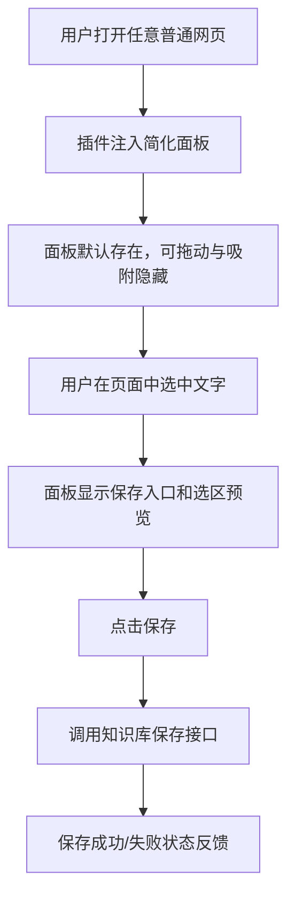
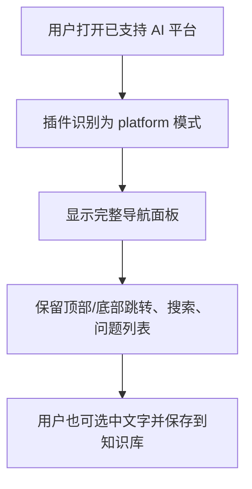

# Browser Extension Dual-Mode Design

## 背景

当前浏览器插件只会注入到少数固定的 AI 平台页面：

- ChatGPT
- Gemini
- Kimi
- 通义千问
- 豆包

在这些页面中，插件同时承担两类职责：

- 对“用户问题”做识别、索引、搜索与跳转
- 将用户选中的文本保存到个人知识库

这套能力在 AI 对话页里是成立的，但在普通网页中存在两个问题：

1. 插件不会出现，用户无法在任意网页里直接摘录内容
2. 当前导航能力依赖特定平台 DOM 结构，不适合强行扩展到所有网页

新的需求不是把“AI 对话导航”泛化到所有网页，而是把插件升级为一个更通用的网页摘录工具：

- 在普通网页中，作为常驻的可拖拽工具出现
- 用户选中文字后，可以直接保存到知识库
- 在现有 AI 平台页面中，继续保留当前完整功能

因此需要把插件从“固定平台专用工具”演进为“通用摘录工具 + 平台增强能力”的双模式结构。

## 目标

本次调整的目标是：

- 插件在绝大多数普通网页中也能显示
- 普通网页模式保留当前面板外壳交互：
  - 默认存在
  - 可拖动
  - 靠左右边缘自动吸附隐藏
- 普通网页模式仅提供通用摘录能力，不提供消息导航能力
- AI 平台模式继续保留当前全部功能
- 两种模式共用同一套面板外壳、保存链路与状态反馈

## 非目标

本次不做以下内容：

- 不在普通网页中自动识别“段落目录”或“页面章节导航”
- 不在所有网页上自动提取结构化文章大纲
- 不为普通网页新增右键菜单、浏览器工具栏弹窗或快捷键保存入口
- 不重写整套扩展架构为 React 或新的构建系统
- 不修改现有后端保存接口语义

## 方案对比

### 方案 1：单一面板，按页面能力切换模式（推荐）

扩展仍然只维护一个 content script 面板壳。初始化时先识别页面类型：

- 命中特定 AI 平台时进入 `platform` 模式
- 其他普通网页进入 `generic` 模式

两种模式共享：

- 面板创建
- 拖动与吸附
- 选区监听
- 保存到知识库
- 状态提示

只有导航相关功能按模式开关。

优点：

- 最大程度复用现有代码
- 用户交互一致
- 最适合当前项目的脚本结构

缺点：

- `main.js` 和 `ui.js` 需要引入更明确的模式分支

### 方案 2：同一入口，渲染两套独立面板内容

保留统一注入入口，但 `platform` 和 `generic` 模式分别维护不同的 DOM 布局。

优点：

- 模式边界更直观

缺点：

- UI 逻辑容易复制
- 共享状态变复杂

### 方案 3：平台页与普通页拆成两套初始化器

AI 页面和普通网页各自走独立初始化流程，甚至使用不同 content script。

优点：

- 模式隔离最彻底

缺点：

- `manifest`、共享逻辑、状态存储都会更分散
- 对当前代码规模来说过重

推荐方案：方案 1。

## 设计总览

插件升级为双模式运行：

- `platform` 模式：针对已支持的 AI 平台，保留现有导航、搜索、跳转、选区保存能力
- `generic` 模式：针对普通网页，保留面板外壳、选区监听和知识保存能力，禁用导航相关功能

核心原则：

- “页面是否支持导航”与“页面是否支持摘录”解耦
- 摘录能力变成所有普通网页的基础能力
- 导航能力继续作为平台增强能力，仅在已知页面启用

## 用户流程

### 普通网页模式

### 特定页面模式

## 页面模式判定

### 判定规则

初始化时执行统一检测：

1. 若 `hostname` 命中已支持平台配置，则进入 `platform` 模式
2. 否则若当前页面属于普通 `http/https` 网页，则进入 `generic` 模式
3. 对浏览器内部页、扩展页、`chrome://`、`edge://`、`about:`、`devtools:` 等不可注入页面，不运行插件

### 设计要求

- `detectPlatform()` 不再是“命中平台 or 返回 null 后退出”
- 新增统一页面能力判定，例如：
  - `pageMode = 'platform' | 'generic'`
  - `platformKey = 'chatgpt' | 'gemini' | ... | null`

这样可以避免把“未识别平台”误等同于“无需显示插件”。

## manifest 调整

### 注入范围

`content_scripts.matches` 需要从“固定平台白名单”扩展到普通网页：

- `http://*/*`
- `https://*/*`

不需要尝试覆盖浏览器内部特殊页，因为这些页面本身不能按普通规则注入 content script。

### 风险控制

扩大注入范围后，需要确保普通网页模式初始化逻辑足够轻：

- 不做高频 DOM 扫描
- 不启动导航观察器
- 不反复搜索问题列表选择器

否则在普通网页里会造成无意义的性能开销。

## UI 设计

### 共用能力

两种模式都保留以下行为：

- 面板标题栏
- 拖动移动
- 左右吸附隐藏
- 展开/收起
- 选区监听
- 保存入口
- 保存状态提示

### 平台模式

继续显示当前完整结构：

- 顶部按钮：`↑ 顶部`、`↓ 底部`
- 搜索框：搜索当前消息
- 对话问题列表
- 选区保存入口

### 普通网页模式

使用同一面板壳，但隐藏以下区块：

- 顶部/底部跳转按钮
- 搜索框
- 导航列表
- 与消息定位相关的 tooltip/active item 逻辑

普通网页模式保留的内容：

- 标题栏
- 保存选中文本入口
- 选区预览
- 保存状态提示

### 文案调整

普通网页模式中的文案应从“对话导航工具”变成“通用摘录工具”语义，例如：

- 标题仍可保留 `个人知识库`
- 当没有选区时，可以显示简短说明：
  - `选中网页中的文字后可直接保存到知识库`

目标是避免在普通网页里出现“搜索当前消息”“跳转到底部”这类不成立的语义。

## 模块边界

本次不重构整个扩展，但需要把现有脚本中的职责边界明确化。

### `platforms.js`

负责：

- 已支持平台配置
- 平台识别
- 平台主题类与导航能力元数据

新增职责：

- 提供统一页面模式判断所需的辅助信息

### `main.js`

负责：

- 统一初始化
- 根据页面模式决定启用哪些控制器
- 管理面板生命周期

调整后应显式分为两段：

- 共享初始化：面板、拖拽、选区监听、保存能力
- 模式增强初始化：
  - `platform` 模式启用导航
  - `generic` 模式跳过导航

### `ui.js`

负责：

- 创建面板壳
- 根据模式控制区块显隐
- 保持拖拽、吸附与状态提示一致

### `navigation.js`

继续只服务 `platform` 模式。

要求：

- 普通网页模式完全不初始化导航控制器
- 不在普通网页中建立 scroll observer、定时 DOM 检查或搜索索引

### `capture.js`

继续作为共享保存能力模块。

要求：

- 不依赖平台导航存在
- 在普通网页模式中也能仅凭选区和当前 URL 构造保存请求

## 数据流

### 普通网页模式

1. content script 注入面板
2. 用户选中文字
3. 插件读取选区文本和当前 URL
4. 插件调用知识库接口
5. 后端按现有逻辑保存为记忆

### 平台模式

1. content script 注入完整面板
2. 导航模块识别页面内用户消息
3. 用户可使用搜索/跳转
4. 用户也可以选中文字走同一条保存链路

## 错误处理

### 普通网页模式

- 没有选区时，不显示保存入口或显示为不可操作状态
- 保存失败时，保留当前选区预览与错误提示
- 页面本身没有可导航结构时，不应出现任何导航错误日志刷屏

### 平台模式

- 平台选择器失效时，导航功能可以降级为空列表
- 即使导航失败，摘录保存仍应继续可用

### 初始化失败保护

- 模式检测失败时，应优先降级到 `generic`，而不是直接退出
- 只有在页面完全无法注入或 DOM 环境异常时才放弃初始化

## 性能要求

扩大到全网页注入后，普通网页模式必须是轻量模式：

- 不轮询页面消息列表
- 不建立问题导航索引
- 不触发无意义的高频 DOM 查询
- 仅在选区变化、鼠标抬起、窗口 resize 等必要事件上工作

这是本次设计里最重要的非功能约束之一。

## 验证方案

### 功能验证

1. 在普通文章页中，插件面板出现
2. 面板可以拖动、吸附隐藏、再次展开
3. 选中文字后可以保存到知识库
4. 在 ChatGPT / Gemini / Kimi 等既有页面中，原有导航能力仍可用
5. 在这些平台中，文字保存能力不回退

### 回归验证

- 普通网页模式下不显示导航区块
- 平台模式下仍显示完整导航区块
- 普通网页模式不启动导航轮询逻辑
- 平台模式平台识别与消息定位不回退

### 建议测试方式

- content script 的模式判定与配置选择可做轻量单元测试
- 其余以手工回归为主，覆盖：
  - 一个普通新闻/文档页面
  - 一个 AI 平台页面
  - 一个不包含明显文本选区的简单页面

## 风险与缓解

### 风险 1：全网页注入后性能退化

缓解方式：

- 让 `generic` 模式完全跳过导航初始化
- 保持普通网页模式只启用最小事件监听

### 风险 2：普通网页 UI 仍带有 AI 对话语义

缓解方式：

- UI 区块和文案按模式显隐
- 将导航相关占位从普通模式中移除

### 风险 3：平台识别失败导致原有页面行为异常

缓解方式：

- 平台识别逻辑保持原状
- 只在“未命中平台”时才切到 `generic`
- 不改变现有平台配置字段语义

## 结论

推荐实现方式是：

- 将扩展升级为 `platform` / `generic` 双模式
- 把“知识摘录”提升为所有普通网页都可用的基础能力
- 把“对话导航”保留为已支持 AI 平台的增强能力
- 继续复用现有面板壳、拖拽吸附、保存链路
- 在普通网页中以轻量模式运行，避免不必要的导航扫描与性能损耗

这条路径能在不推翻现有插件实现的前提下，把产品从“AI 平台专用插件”扩展为“通用网页摘录工具”，同时保住当前特定页面里的完整能力。
